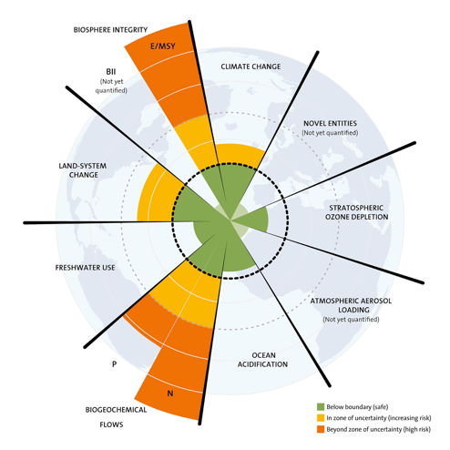

### Nach Lesen dieses Kapitels können Sie:

1.  Grundbegriffe und Konzepte der Öffentlichen und Globalen Gesundheit
    benennen.

2.  Unterschiedliche Definitionen des Begriffs Globale Gesundheit und damit
    verbundene Unschärfen erklären.

3.  Die Begriffe Globale Gesundheit, Internationale Gesundheit, Öffentliche
    Gesundheit (*Public Health*), Eine Gesundheit (*One Health*), Planetare
    Gesundheit (*Planetary Health*) einordnen.

4.  Unterschiede von gesundheitlicher Chancengleichheit (*Health Equity*) und
    Gesundheitsgleichheit (*Health Equality*) und den damit verbundenen
    Konzepten erklären.

5.  Die wichtigsten Grundsätze der Konzepte Basisgesundheitsversorgung (*Primary
    Health Care*), Soziale Determinanten von Gesundheit (*Social Determinants of
    Health*), Allgemeine Gesundheitsversorgung (*Universal Health Coverage*),
    Gesundheit in allen Politikbereichen (*Health in all Policies*), Nachhaltige
    Entwicklungsziele (*Sustainable Development Goals*), Internationale
    Gesundheitsvorschriften (*International Health Regulations*), Zentrale
    Aufgaben im Bereich Öffentliche Gesundheit (*Essential Public Health
    Operations*), sowie einige der nationalen Rechtsgrundlagen wie das
    Präventionsgesetz, die Gesundheitsdienstgesetze und das
    Infektionsschutzgesetz erläutern.

Viele Studierende und Berufstätige beschäftigen sich im Zusammenhang mit einem
Auslandsaufenthalt und mit Berichten über die Gesundheit der Bevölkerung ihres
Gastlandes oder mit internationalen Gesundheitsvergleichen mit dem Thema Globale
Gesundheit und finden dabei auch Interesse an Öffentlichen Gesundheitsfragen in
Deutschland. Erst später wird dann oft erkannt, wie relevant weltweite Aspekte
für Gesundheit auch für bevölkerungsmedizinische Aspekte in Deutschland zu
verstehen sind.

Im Folgenden werden einige Grundbegriffe und Konzepte aus der Globalen und
Öffentlichen Gesundheit vorgestellt die im Laufe der letzten Jahrzehnte Maßstäbe
gesetzt haben oder die regelmäßig in aktuellen Debatten zu globaler Gesundheit
erwähnt werden und die sich kontinuierlich weiterentwickeln. Die Darstellung
erhebt keinen Anspruch auf Vollständigkeit und ist als Anreiz gedacht, sich
weiter mit diesen Konzepten zu beschäftigen.

Auf einzelne Strategiepapiere, Aktionspläne, oder relevante Dokumente zu
spezifischen Themenfeldern, wie z.B. Mutter/Kind Gesundheit, vernachlässigte
Tropenkrankheiten, nicht übertragbare Erkrankungen, etc., kann im Folgenden
nicht im Detail eingegangen werden.

## Grundbegriffe

### **Globale Gesundheit**

Der Begriff **Globale Gesundheit (Global Health)** wird in den letzten
Jahrzehnten unterschiedlich ausgelegt. Dies bedingt Diskussionen über
Eingrenzungen, Begriffsschärfe und Abgrenzungen zu anderen Konzepten. Bei der
Einordnung des Begriffes ist zu berücksichtigen, dass bei unterschiedlichen
Akteuren verschiedene Konzepte darunter verstanden werden, und diese
Unterschiede oft nicht explizit werden. Daher ist anzunehmen, dass eine
Kommunikation über Globale Gesundheit oft zu Missverständnissen führt. So wird
Globale Gesundheit etwa als akademisches Fach, als Berufsfeld, als
werteorientierte Haltung, als Frage nationaler Sicherheit, oder auch manchmal
auch als neues Label für alles was bisher internationale Gesundheit hieß,
verstanden.

Eine gängige Definition beschreibt Globale Gesundheit als interdisziplinäres und
multidisziplinäres Gebiet, welches Themen umfasst, die sowohl die Gesundheit
einzelner Menschen, d.h. auf individueller Ebene, als auch auf Bevölkerungsebene
betreffen, einer globalen Zusammenarbeit bedürfen und bei denen gesundheitliche
Chancengleichheit und soziale Gerechtigkeit eine große Rolle spielen. (Koplan et
al. 2009)

Die Nationale Akademie der Wissenschaft Leopoldina beschreibt Global Health 2015
als:

>   *„Global Health reicht über nationale Grenzen und Regierungen hinaus und
>   muss sich in dieser Eigenschaft mit den vielfältigen Determinanten von
>   Gesundheit befassen – mit den sozialen, wirtschaftlichen und umweltbedingten
>   – sowie mit der globalen Krankheitslast. Sie hält viele multisektorale
>   Herausforderungen bereit und braucht starke, globale
>   Governance-Institutionen.“* (Nationale Akademie der Wissenschaften
>   Leopoldina, acatech – Deutsche Akademie der Technikwissenschaften 2015)

Eine 2018 veröffentlichte Studie befragte Lehrende im Bereich Globale Gesundheit
aus Deutschland zu ihrem Verständnis der Disziplin. Ein zentrales Ergebnis ist
das Verständnis von Globale Gesundheit als sogenannter übergeordneter Begriff
(*umbrella term*) (Havemann and Bösner 2018). Globale Gesundheit hat damit
eigenständige Kernbereiche, vor allem im Sinne der supraterritorialen
Determinanten von Gesundheit, kann aber auch eine ganze Reihe weiterer Aspekte
aus klassischen Disziplinen wie Öffentliche Gesundheit, Internationale
Gesundheit oder Tropenmedizin abdecken (Bozorgmehr 2010).

Themen und Herausforderungen Globaler Gesundheit sind auf globaler, nationaler,
regionaler und lokaler Ebene relevant für die Gesundheit auf bevölkerungs- und
individualmedizinischer Ebene. Dabei beschränkt sich Globale Gesundheit weder
auf sozial- noch biomedizinische Aspekte, sondern integriert diese in einem
interdisziplinären Ansatz. Interdisziplinär bedeutet hierbei, dass keiner
Disziplin eine "Fachhoheit" zukommt, sondern dass alle die Disziplinen beteiligt
werden sollen, die für Lösungsansätze sowie den Umgang mit einem Problem, z.B.
Klimawandel, Antimikrobielle Resistenzen, benötigt werden.

Globale Gesundheit beinhaltet oftmals eine normative Komponente: Es geht um die
Förderung und Aufrechterhaltung von gesundheitlicher Chancengleichheit. Dies
bedeutet, dass auf dem Weg zur Erreichung des Ziels **Gesundheit für Alle**
(*health for all*) vor allem diejenigen Gruppen gefördert werden, die besonders
vulnerabel und deren Lebensumstände besonders vernachlässigt sind. Neben der
Frage der unterschiedlichen Definitionen spielt die Perspektive, aus der Globale
Gesundheit gelehrt, beforscht und praktiziert wird, ine wichtige Rolle.

Zur Verdeutlichung dieses Spannungsfelds kann man sich an den Ansätzen von Cole
et al. sowie von Labonté et al. orientieren. Während Cole et al. ein eigenes
Modell im akademischen Kontext entwickeln, analysieren Labonté und Gagnon die
Diskurse zu Globale Gesundheit aus einer "Policy" Perspektive, also entlang
konkreter politischer Initiativen oder Ziele (Cole, Jackson, and Forman 2017;
Labonte and Gagnon 2010). Eine dritte Perspektive berücksichtigt die räumliche
Dimension von Globaler Gesundheit, welche sich in lokale, -nationale und globale
Aktionsfelder gliedert.

Die Akteure dieser Aktionsfelder sind in Kapitel 3 genauer beschrieben. Die
verschiedenen Ansätze sind in Tabelle 1 visualisiert.

Tabelle 1: Unterschiedliche Ansätze in Globaler Gesundheit

Die Entwirrung und Bewusstwerdung verschiedener Ansätze in Globaler Gesundheit
kann dazu beitragen, sich des eigenen Verständnisses sowie eigener
Handlungskontexte in Globaler Gesundheit klarer zu werden.

### **Internationale Gesundheit**

Der Begriff **Internationale Gesundheit (International Health)** hat historische
Bezüge zu den Bereichen von Tropenmedizin und Hygiene. Es bestehen große
Schnittmengen zu Globaler Gesundheit, jedoch gibt es auch Ansätze der
Abgrenzung. So werden unter Internationale Gesundheit eher bilaterale
Aktivitäten, mit Fokus auf Gesundheitsprobleme in Ländern mit geringen und
mittleren Einkommen, die aus Ländern mit hohen Einkommen unterstützt werden,
verstanden. (Koplan et al. 2009)

Die Abgrenzung zu Globale Gesundheit sind aus Sicht dieser Autoren
transnationale Gesundheitsprobleme, die nur durch interdisziplinäre und
transnationale Kollaboration gelöst werden können (bspw. Tabakkontrolle,
Übergewicht, Pandemien, Klimazerstörung u.a.). Es ist zu beobachten, dass auf
Grund der Popularität des Begriffes Globale Gesundheit viele Initiativen und
z.T. auch Institute von Internationale zu Globaler Gesundheit umbenannt werden,
bisweilen jedoch unter Beibehaltung der bisherigen Aktivitätsschwerpunkte.

### **Öffentliche Gesundheit**

Der Begriff der Öffentlichen Gesundheit bezeichnet – analog dem englischen
Begriff *Public Health* – die Wissenschaft und Praxis, durch organisierte
gesellschaftliche Anstrengungen Krankheit zu vermeiden, Leben zu verlängern, und
Gesundheit zu fördern (Nachwuchsnetzwerks Öffentliche Gesundheit 2019).

Bei der Abgrenzung der Begriffe Public Health, Öffentliche Gesundheit und
Globale Gesundheit handelt es sich um eine viel diskutierte und andauernde
Debatte. Dieses Buch soll zur einer Erweiterung des Verständnisses und zur
Darlegung gemeinsamer Schnittstellen und überlappender Bereiche in Theorie und
Praxis beitragen.

Nach Koplan et al (2009) fokussiert sich Public Health auf den
Gesundheitszustand innerhalb einer Nation und verlangt selten globale
Kooperation (Koplan et al. 2009). Dieser Sichtweise wurde vielfach widersprochen
und der Begriff "Global Public Health" zunehmend ins Spiel gebracht (Fried et
al. 2010; Beaglehole and Bonita 2010).

Insgesamt ist festzuhalten, dass die Abgrenzungen der Begriffe entlang unklarer
Linien verlaufen, und es jeweils breite Überlappungsbereiche gibt. Havemann und
Bösner haben 2018 auf der Basis von Interviews mit Lehrenden in Global Health in
Deutschland folgende hilfreiche Grafiken entwickelt, die näherungsweise den
Stand der aktuellen Diskussion abbilden (Havemann and Bösner 2018).

Abbildung 1: Der Begriff Globale Gesundheit als Überbegriff (aus Havemann &
Bösner, 2018)

In ihren visuellen Darstellungen sind sie auf die zeitliche Entwicklung der
Disziplin Globale Gesundheit, mit Ursprüngen und Vorläuferdisziplinen
eingegangen und haben diese in Bezug gesetzt. Auch auf die neuere Disziplin der
**Planetaren Gesundheit (Planetary Health)** sind sie eingegangen und haben sie
in ihrem Konzept integriert.

Abbildung 2: Die Entstehung und Entwicklung der Bezeichnung

### **Eine Gesundheit**

Unter dem Begriff **Eine Gesundheit (One Health)** versteht man einen
transdisziplinären Ansatz, um die systematischen Zusammenhänge und
Wechselwirkungen der Gesundheit von Menschen, Tieren und Pflanzen sowie der
Umwelt in den Blick zu nehmen.

Hintergrund ist u.a. der Klimawandel, die zunehmende globale Bedeutung von
Zoonosen, die vermehrte grenzüberschreitende Ausbreitung von Krankheitserregern,
die Intensivierung der Lebensmittelproduktion sowie die zunehmende Bedeutung von
antimikrobiellen Resistenzen, um nur einige der Herausforderungen zu nennen.

Abbildung 3: One Health - als Verbindung zwischen Umwelt, Tier und menschlicher
Gesundheit

### **Planetare Gesundheit**

Der Begriff von **Planetarer Gesundheit (Planetary Health)** stammt aus einem
Kommentar im Lancet von 2014, auf welchen aufbauend 2015 die [Rockefeller
Foundation-Lancet Commission on Planetary
Health](https://www.thelancet.com/commissions/planetary-health) begründet wurde
(Horton et al. 2014).

Planetare Gesundheit wird komplementär zu den oben genannten Begriffen verwendet
und teils als Erweiterung des Begriffes Global Health verstanden, teils als zu
Globale Gesundheit zugehöriges Themenfeld beschrieben. Im Zentrum von Planetarer
Gesundheit stehen die Wechselwirkungen der Gesundheit der Menschen und der
Ressourcen des Planeten, von welchen die Gesundheit abhängt. Es ist daher ein
Schnittpunkt zwischen Gesundheits- und Umwelt-/ bzw. Naturwissenschaften.
Klimawandel, Reduktion der Biodiversität, Umweltverschmutzung und Fragen zu
nachhaltigen Ernährungsformen sind zentrale Elemente von Planetarer Gesundheit.
Welche Herausforderungen sich daraus ergeben, zeigt das Konzept der Planetaren
Grenzen. Planetare Grenzen sind Prozesse, welche die Stabilität und Resilienz
auf der Erde bestimmen und im Rahmen derer sich die Menschheit weiterentwickeln
kann. Das Überschreiten der Grenzen führt zu möglicherweise unumkehrlichen
Veränderungen der Umwelt (Rockström et al. 2009). Aus dem umfassenden Charakter
des Konzeptes Planetare Gesundheit lässt sich die Notwendigkeit
interdisziplinärer Lösungsansätze und lokaler, nationaler und globaler
Zusammenarbeit ableiten. Die Notwendigkeit zu umfassender Transformation in
Bereichen von z.B. Mobilität, Ernährung und Energieversorgung mit dem Ziel der
Reduktion von sowohl klimaschädlichen als auch gesundheitsschädlichen Emissionen
wird als zunehmend dringlich wahrgenommen, um ein gutes und gesundes Überleben
der menschlichen Zivilisation auf diesem Planeten zu ermöglichen. Es werden
zahlreiche weitere Vorteile, sogenannte *Co-Benefits,* beschrieben, die sowohl
dem Schutz des Klimas und der Umwelt als auch der menschlichen Gesundheit
dienen. In diesem Kontext gewinnt das Konzept Planetare Gesundheit aktuell
zunehmend an Bedeutung.

Abbildung 4: Veränderung der Kontrollvariablen von Planetaren Grenzen, grüne
Flächen markieren Räume, die nachhaltige Entwicklung ermöglichen (P= Phosphorus,
N= Nitrogen, BII= Functional diversity, E/MSY= Genetic diversity). Quelle:
Stockholm Resilience Centre)

### Gesundheitsberichterstattung des Bundes

Die **Gesundheitsberichterstattung** (GBE) des Bundes berichtet regelmäßig über
die gesundheitliche Lage und die gesundheitliche Versorgung der Bevölkerung in
Deutschland. Sie ist eine gemeinsame Aufgabe des Robert Koch-Instituts (RKI) und
des Statistischen Bundesamtes. Themen reichen von Krankheiten und Beschwerden
über das Gesundheitsverhalten und Risikofaktoren bis hin zur medizinischen und
pflegerischen Versorgung und der damit verbundenen Kosten. In die GBE fließen
Daten des Gesundheitsmonitorings, anderer epidemiologischer Studien, amtliche
Statistiken, epidemiologischer Register und Routinedaten der
Sozialversicherungsträger ein. (Robert Koch-Institut 2019)

Daten der GBE in Deutschland stehen Entscheidungsträgern für Ansätze, die
Bevölkerungsgesundheit zu verbessern, zur Verfügung und fließen in
internationale Abschätzungen des globalen Gesundheitszustandes mit ein. Die
Menge und Qualität von Daten, welche über Gesundheit gesammelt werden, variiert
im weltweiten Vergleich stark.

### Die Studie zu Globaler Gesundheitslast

Was sind die größten gesundheitlichen Probleme der Welt? Wie erfolgreich geht
die Menschheit diese Probleme an? Wie wird Gesundheitsversorgung finanziert und
wie können wir Ressourcen bestmöglich einsetzen, um die Gesundheit der
Weltbevölkerung zu verbessern?

Globale Gesundheitsdaten, die standardisiert erfasst und vergleichbar
ausgewertet werden, können helfen, derartige Fragestellungen auf Basis
empirischer Erkenntnisse zu beantworten. Die **Studie zu Globaler
Gesundheitslast (Global Burden of Disease Study)** ist die wohl meistgenutzte
Quelle für Informationen über die Gesundheit von Bevölkerungen weltweit
(Institute for Health Metrics and Evaluation (IHME) 2017). Aktuelle Ergebnisse
bestätigen den Trend einer weltweit zunehmenden Lebenserwartung, weisen auf
anhaltende Versorgungs- und Finanzierungslücken hin und zeigen, wie sich die
Hauptursachen der Krankheitslast auf der ganzen Welt immer ähnlicher werden.
Jedoch ist zu berücksichtigen, dass die beschriebenen Veränderungen in der
globalen Gesundheit oft nicht gemessen, sondern anhand begrenzt verfügbarer
Daten geschätzt werden.

Zu den Gesundheitsindikatoren, welche die GBD Studie berechnet, zählen

1.  **Lebenserwartung (Life Expectancy, LE)** misst die Anzahl der Lebensjahre,
    die ein Mensch in einem bestimmten Alter voraussichtlich noch leben wird.
    Ohne Altersangabe, bezieht sich die Lebenserwartung auf den Zeitpunkt der
    Geburt.

2.  **Gesunde Lebenserwartung (Healthy Life Expectancy, HALE)** drückt die
    Lebenserwartung unter Berücksichtigung des voraussichtlichen
    Gesundheitszustands aus. Lebensjahre, für die eine gesundheitliche
    Beeinträchtigung erwartet wird, werden bei der gesunden Lebenserwartung mit
    einem Faktor für die voraussichtliche Beeinträchtigung des
    Gesundheitszustands multipliziert.

3.  **Mit Beeinträchtigung gelebte Lebensjahre (Years Lived with Disability,
    YLDs)** sind die Anzahl von Jahre, die mit gesundheitlichen Einschränkungen
    erlebt werden. Dazu zählen Erkrankungen, die nur wenige Tage bis Wochen
    andauern (z. B. eine Grippe), ebenso wie Erkrankungen, die ein Leben lang
    bestehen bleiben (z. B. Formen der Epilepsie). Mit Beeinträchtigung gelebte
    Lebensjahre werden abgeschätzt, indem die Häufigkeit einer Erkrankung mit
    einem Faktor für deren Auswirkung auf den Gesundheitszustand multipliziert
    wird. Diese Faktoren werden mit Hilfe von Befragungen der
    Allgemeinbevölkerung entwickelt.

4.  **Durch vorzeitigen Tod verlorene Lebensjahre (Years of Life Lost, YLLs)**
    sind Jahre, die durch vorzeitige Sterblichkeit verloren gehen. Diese werden
    berechnet, indem das Todesalter von der höchsten Lebenserwartung eines
    Menschen in diesem Alter abgezogen wird. Wenn zum Beispiel die höchste
    Lebenserwartung für Männer in einem bestimmten Land 75 Jahre beträgt, ein
    Mann aber mit 65 Jahren an einer Krebserkrankung stirbt, wären das 10 Jahre
    verlorenes Leben durch die Krebserkrankung.

5.  **Beeinträchtigungsbereinigte Lebensjahre (Disability Adjusted Life Years,
    DALYs)** sind ein Maß der Krankheitslast und entsprechen der Summe aus durch
    vorzeitigen Tod verlorenen Lebensjahren (YLLs) und mit Beeinträchtigung
    gelebter Lebensjahre (YLDs). Ein DALY entspricht einem verlorenen gesunden
    Lebensjahr. Dieser Gesundheitsindikator kann genutzt werden, um krankheits-,
    länder- oder personenübergreifend die Gesamtzahl der Lebensjahre
    abzuschätzen, die aufgrund bestimmter Krankheiten und Todesursachen mit
    Beeinträchtigung bzw. nicht gelebt werden.

Die Studie zur globalen Krankheitslast (engl. [Global Burden of Disease
Study](%20%20http://www.healthdata.org/gbd)) versucht aufgrund verfügbarer
Daten, ähnlich der Gesundheitsberichterstattung des Bundes in Deutschland, für
die globale gesundheitliche Situation Daten zur Verfügung zu stellen. Die Menge,
Qualität und Vergleichbarkeit von Daten, welche über die Gesundheit gesammelt
werden, variiert im weltweiten Vergleich erheblich, sodass jährlich
veröffentlichte Ergebnisse der Global Burden of Disease Studie in hohem Maße auf
statistischer Modellierung beruhen. Im Kapitel "Arbeit im ÖGD im Kontext
Globaler Gesundheit" dieses Buches werden die zentralen Daten aus dieser Studie
vorgestellt.

(In den Abschnitten über die Global Burden of Disease Studie wurden Inhalte aus
Kohler (2019) übernommen.)

## Konzepte

### **Basisgesundheitsversorgung**

Im Jahr 1978 konnte der damalige Generaldirektor der Weltgesundheitsorganisation
Halfdan Mahler einen Konsens für eine Änderung der Gesundheitspolitik erreichen.
Bis dahin herrschten vornehmlich vertikale (erkrankungsspezifische) und
erkrankungsorientierte Herangehensweisen vor, oft mit dem Ziel der
Infektionskontrolle (z.B. Malaria, Tuberkulose, Pocken). Obwohl erfolgreich in
manchen Bereichen, z.B. bei der Pockeneradikation, gab es keine Erfolge in
anderen Bereichen, z.B. Malaria-Bekämpfung. Eine sogenannte vertikale
Herangehensweise berücksichtigt Verbindungen, die zwischen unterschiedlichen
Erkrankungen oder zu sozioökonomischen und umweltbedingten Einflussfaktoren auf
die Gesundheit bestehen, oftmals nicht umfassend. Dieser Ansatz führte auch
nicht zu einer Stärkung der Gesundheitssysteme. (Lindstrand et al. 2006)

Gegen Ende der 70er Jahre erfolgte ein Richtungswechsel. In der Alma-Ata
Konferenz 1978 wurde die **Basisversorgung (Primary Health Care***, PHC***)**
Strategie beschlossen mit dem Slogan: „Gesundheit für alle im Jahr 2020“. (World
Health Organisation 1978)

Die Grundelemente für die zukünftige öffentliche Gesundheit wurden dort gelegt
(World Health Organisation 1978; Lindstrand et al. 2006; World Health
Organisation 2019a):

1.  Fokus auf die Lebensweise und Bedürfnisse der Bevölkerung, Priorität für die
    vulnerablen Gruppen und Fokus auf gesundheitliche Chancengleichheit

2.  Integration in das nationale Gesundheitssystem

3.  Intersektorale Herangehensweise (Landwirtschaft, Bildung, Wasser, …)

4.  Teilhabe der Bevölkerung in der Suche nach Lösungen

5.  Nutzung von lokalen Ressourcen unter Berücksichtigung derer eingeschränkten
    Verfügbarkeit

6.  Integration und Koordination von gesundheitsfördernden, präventiven,
    kurativen und rehabilitativen Maßnahmen und Berücksichtigung der breiten
    Determinanten von Gesundheit

7.  dezentralisierte Dienste, so nah wie möglich an den Menschen.

Die Konferenz in Alma Ata läutete die Entwicklung hin zur gemeindebasierten
Medizin ein, weg vom rein kurativen hin zu gemischten präventiv-kurativen
Ansätzen, weg von einer sogenannte "von-oben-herab" (*top-down*)
Herangehensweise hin zur Gemeindeorientierung und Beteiligung (*participation*),
mit dem Ziel, dass alle Menschen den höchst erreichbaren Standard an Gesundheit
erreichen können. Aus unterschiedlichen Gründen wurden die ehrgeizigen Ziele der
Alma Ata Erklärung nicht erreicht. Unter anderem fehlten Pläne für deren
Umsetzung, eine ausreichende Finanzierung wurde nicht geklärt, und auf die
ökonomischen Krisen der 80er folgte die Verbreitung von neoliberalen Ansätzen
mit der Folge des Abbaus von öffentlichen Infrastrukturen. (Farmer et al. 2013)

Im Jahr 1986 wurde in Ottawa, Kanada, die sogenannte "[Ottawa Charta for Health
Promotion](https://www.who.int/healthpromotion/conferences/previous/ottawa/en/)*"*
unter Federführung der WHO verabschiedet. Darin wurde das Konzept der
Gesundheitsförderung eingeführt. Es zielt unter anderem auf Gestaltung der
gesundheitsrelevanten politischen, sozialen, ökonomischen, kulturellen,
biologischen Faktoren und Umweltbedingungen. Es gilt als ein Folgedokument der
Erklärung von Alma Ata und wurde in Folgekonferenzen weiterentwickelt und
ausdifferenziert. (World Health Organisation 1986)

In den 2000er Jahren verschob sich der Fokus auf Reformen der Gesundheitssysteme
mit dem Ziel, die Qualität und die Zugänglichkeit von
Gesundheitsdienstleistungen zu ermöglichen. Kritik an der Umsetzung der
Basisversorgung und Rufe nach "Revitalisierung" des Konzepts auf der Basis der
Erfahrungen der vorangegangenen drei Dekaden und der zunehmenden Evidenz wurden
immer lauter (Lawn et al. 2008). Vierzig Jahre nach Alma Ata wurde 2018 die
Astana Erklärung verabschiedet, in welcher die Prinzipien der primären
Basisversorgung zur Verbesserung des Gesundheitsstatus durch umfassende und
integrierte Versorgung und Adressierung der Gesundheitsdeterminanten unter
Partizipation und Befähigung (*empowerment*) der Bevölkerung erneut bekräftigt
wurden. (World Health Organisation 2018)

### **Gesundheits(un)gerechtigkeit und Gesundheits(un)gleichheit**

Die Ähnlichkeit der englischen Begriffe, so wie die Schwierigkeit, sie ins
Deutsche zu übersetzen, führen oftmals zu Unschärfen. **Health (In)equity**
bezieht sich am ehesten auf **Gesundheits(un)gerechtigkeiten**, während **Health
(In)equality** am ehesten mit **Gesundheits(un)gleichheiten** übersetzt werden
kann.

Abbildung 5: Illustration der Konzepte Equality & Equity (Illustration: Angus
Maquire, https://www.storybasedstrategy.org)

Diese zwei Begriffe unterscheiden sich in einem wichtigen Aspekt voneinander:
Von einer Gesundheitsungleichheit spricht man, wenn sich Morbiditäts- oder
Mortalitätsziffern in unterschiedlichen Bevölkerungsgruppen auf Grund von
unveränderlichen Merkmalen (wie Alter, biologisches Geschlecht, genetische
Faktoren) unterscheiden. Einige Ungleichheiten lassen sich nicht vermeiden (so
sind beispielsweise Männer auf Grund ihres biologischen Geschlechts nicht von
Müttersterblichkeit betroffen).

Von Health Inequity (manchmal auch **Health Disparity** genannt) - also am
ehesten mit Ungerechtigkeit zu übersetzen - spricht man, wenn sich
Gesundheitsdaten verschiedener Bevölkerungsgruppen voneinander unterscheiden auf
Grund von Einflüssen, die veränderbar wären. Dies sind beispielsweise der
sozioökonomische Status, Zugang zu Gesundheitsversorgung, sexuelle Orientierung,
Bildungsstatus oder Umweltfaktoren die durch die Wohnverhältnisse determiniert
werden (z.B. Luftverschmutzung, Lärm, sanitäre Versorgung usw.). Daher sprechen
viele von **gesundheitlicher Chancengleichheit** — ein Begriff, welcher das
Konzept hinter **Health Equity** verdeutlicht. Somit sind die Verringerung von
Health Inequities ein originäres Handlungsfeld von Anstrengungen im Bereich
Globale und Öffentliche Gesundheit.

Als **Vertikale Gerechtigkeit (Vertical Equity)** wird dabei der Ansatz
bezeichnet, das ausgehend von unterschiedlichen Ausgangsvoraussetzungen
unterschiedliche Individuen je nach ihren Bedürfnissen Anrecht auf
unterschiedliche Ressourcen haben sollten. Ein anschauliches Beispiel dafür sind
beispielsweise Vergünstigungen in vielen Lebensbereichen für Menschen mit
Behinderungen. Dieses Konzept ist eng verknüpft mit dem Begriff der Sozialen
Determinanten von Gesundheit, der im Folgenden erläutert wird.

### **Soziale Determinanten von Gesundheit**

Die Gesundheit von Menschen hängt nicht nur von der medizinischen Versorgung im
Erkrankungsfall, sondern maßgeblich auch von den Umständen, unter den Menschen
auf die Welt kommen, aufwachsen, leben, arbeiten und älter werden, ab. Diese
Umstände wiederum sind maßgeblich geprägt von den sozialen, politischen,
kulturellen und ökonomischen Systemen und Institutionen, die die
Lebensrealitäten der Menschen bestimmen. In der Praxis heißt das: Armut macht
krank und reiche Menschen leben länger. Die Weltgesundheitsorganisation (WHO)
hat hierfür den Begriff der **Sozialen Determinanten für Gesundheit** geprägt,
der 2008 von der Kommission für Soziale Determinanten für Gesundheit
veröffentlichte Bericht "[Closing the Gap in a generation - Health equity
through action on the social determinants of
health](https://www.who.int/social_determinants/thecommission/finalreport/en/)"
dient dabei als maßgebliches und viel zitiertes Grundlagendokument. (World
Health Organisation 2008)

In der medizinischen Ausbildung sind Lehrinhalte zu SDHs bislang an vielen
Stellen unzureichend verankert (Hommes et al. 2020a; 2020b).

Aufgabe der Öffentlichen Gesundheit ist es, mit Blick auf diese Determinanten
die Ursachen gesundheitlicher Defizite zu bekämpfen, bevor sie zu Problemen
führen.

### **Allgemeine Gesundheitsversorgung/-sicherung**

Mit dem Konzept der **allgemeinen Gesundheitsversorgung/-sicherung (Universal
Health Coverage, UHC)** wird auf die Tatsache reagiert, dass die Hälfte der
Weltbevölkerung keinen Zugang zu essentiellen Gesundheitsdienstleistungen hat
und dass geschätzte 100 Millionen Menschen im Jahr als Folgen ihrer
Gesundheitsausgaben von extremer Armut bedroht sind (World Health Organisation
2019b).

Das Konzept UHC beinhaltet dabei, dass Individuen und Bevölkerungsgruppen Zugang
zu den Gesundheitsdienstleistungen haben sollten, die sie brauchen, ohne dabei
zu verarmen. UHC beinhaltet das gesamte Spektrum an essentiellen qualitativen
Gesundheitsdienstleistungen - von Gesundheitsförderung zu Prävention,
Behandlung, Rehabilitation und palliativer Versorgung.

Dabei sollten die signifikantesten Ursachen für Morbidität und Mortalität
berücksichtigt werden. UHC soll zudem sicherstellen, dass die Qualität der
Gesundheitsdienstleistungen ausreichend ist für eine Verbesserung des
Gesundheitsstatus (übersetzt nach (World Health Organisation 2019b)).

Abbildung 6: Visuelle Darstellung unterschiedlicher UHC Dimensionen

UHC ist also ein Konzept, dass nicht nur die Gesundheitsfinanzierung und die
Vermeidung von Armut verursachenden Gesundheitsausgaben umfasst, sondern auch
Qualität, Zugänglichkeit und Verfügbarkeit der Gesundheitsdienstleistungen
sicherstellen soll (World Health Organisation 2020). Dazu zählen also neben der
Erbringung von Dienstleistungen, auch Arbeitskräfte, Infrastrukturen und
Technologie, Informationssysteme, Qualitätssicherung, Governance und
Gesetzgebung. Im UHC Konzept werden allerdings sozioökonomische oder
umweltbezogene Determinanten von Gesundheit nicht adressiert. Verschiedene dazu
nötige Dimensionen, wie beispielsweise welche Bevölkerungsgruppe (*population*)
soll durch welche Dienstleistungen (*services*) erreicht werden, was sollen die
Dienstleistungen umfassen (*coverage*) und wie sollen die Dienstleistungen
bezahlbar gemacht werden (*cost affordability*), werden in der Abbildung:
"Visuelle Darstellung unterschiedlicher UHC Dimensionen" gezeigt (World Health
Organisation 2020).

Als Teil der UN Nachhaltigkeitsziele haben die UN-Mitgliedsländer vereinbart,
UHC bis 2030 flächendeckend zu verwirklichen (SDG 3.8).

### Gesundheit in allen Politikbereichen

Nach dem Konzept **Gesundheit in allen Politikbereichen (Health in all Policies,
HIAP)** der WHO ist die Gesundheitsförderung, Prävention und
Gesundheitsversorgung nicht allein eine Aufgabe des Gesundheitssystems, sondern
auch aller übriger Politikbereiche. Die zahlreichen Determinanten von Gesundheit
berücksichtigend, sollte Gesundheit daher in allen Themenfeldern des
öffentlichen und politischen Handelns verfolgt werden.

In der 2013 verabschiedeten Helsinki-Erklärung der 8. Weltkonferenz zur
Gesundheitsförderung der WHO wird HIAP definiert als ein Konzept

>   „f*ür die Politik in allen Sektoren, die Auswirkungen von Entscheidungen auf
>   Gesundheit und Gesundheitssysteme berücksichtigt, Synergien sucht und
>   schädliche Auswirkungen auf die Gesundheit vermeidet, um die Gesundheit der
>   Bevölkerung und gesundheitliche Chancengleichheit zu verbessern*" (Pan
>   American Health Organisation/World Health Organisation 2013)

Es gibt bereits international und national Beispiele für die Anwendung von HIAP,
hierzu wird auf die [Übersicht vom Zukunftsforum Public
Health](https://zukunftsforum-public-health.de/health-in-all-policies/)
verwiesen.

### **Nachhaltige Entwicklungsziele**

Die internationale Gesundheitspolitik wurde auf der Grundlage von PHC mit sich
verändernden Akzenten weiterentwickelt. Im Jahr 2000 wurden die **Millennium-
Entwicklungsziele (Millenium Development Goals, MDGs)** von den Mitgliedsländern
der Vereinten Nationen (*United Nations, UN)* einstimmig beschlossen (United
Nations 2015a). Es wurden im Jahr 2000 acht Ziele, die bis zum Jahr 2015
erreicht werden sollten (gemessen auf der Basis der Daten von 1990), von einer
Arbeitsgruppe aus Vertretern der Vereinten Nationen, der Weltbank, des
Internationalen Währungs Fonds und des Entwicklungsausschusses Development
Assistance Committee der OECD formuliert.

Millenium Development Goals

Der [MDG Bericht
2015](https://www.undp.org/content/undp/en/home/librarypage/mdg/the-millennium-development-goals-report-2015/)
gibt einen Überblick über die Indikatoren (United Nations 2015b).

Im Jahr 2015 wurden die MDGs durch die **17 Nachhaltigkeitsziele (Sustainable
development Goals, SDG)** und die **Agenda 2030** abgelöst. Deren Entwicklung
ging ein breiter Beteiligungsprozess zahlreicher Akteure, inklusive der
Zivilgesellschaft, voraus. Im Gegenteil zu den MDGs, deren Ziele sich vorwiegend
auf Länder mit geringen Einkommen bezogen, betreffen die SDGs alle Länder. Die
17 Ziele umfassen einen Katalog von 169 Zielvorgaben unterteilt in 107
inhaltliche Ziele und 62 Umsetzungs-Maßnahmen.

Abbildung 7: Nachhaltige Entwicklungsziele (Sustainable Development Goals, SDGs)

Gesundheit in den SDGs findet sich im Ziel 3 wieder:

>   *“Ein gesundes Leben für alle Menschen jeden Alters gewährleisten und ihr
>   Wohlergehen fördern”*

Die Zielvorgaben sind folgende:

1.  Bis 2030 die weltweite Müttersterblichkeit auf unter 70 je 100.000
    Lebendgeburten senken.

2.  Bis 2030 den vermeidbaren Todesfällen bei Neugeborenen und Kindern unter 5
    Jahren ein Ende setzen, mit dem von allen Ländern zu verfolgenden Ziel, die
    Sterblichkeit bei Neugeborenen mindestens auf 12 je 1.000 Lebendgeburten und
    bei Kindern unter 5 Jahren mindestens auf 25 je 1.000 Lebendgeburten zu
    senken.

3.  Bis 2030 die Aids-, Tuberkulose- und Malariaepidemien und die
    vernachlässigten Tropenkrankheiten beseitigen und Hepatitis, durch Wasser
    übertragene Krankheiten und andere übertragbare Krankheiten bekämpfen.

4.  Bis 2030 die vorzeitige Sterblichkeit aufgrund von nicht übertragbaren
    Krankheiten durch Prävention und Behandlung um ein Drittel senken und die
    psychische Gesundheit und das Wohlergehen fördern.

5.  Die Prävention und Behandlung des Substanzmissbrauchs, namentlich des
    Suchtstoffmissbrauchs und des schädlichen Gebrauchs von Alkohol, verstärken.

6.  Bis 2020 die Zahl der Todesfälle und Verletzungen infolge von
    Verkehrsunfällen weltweit halbieren.

7.  Bis 2030 den allgemeinen Zugang zu sexual- und reproduktionsmedizinischer
    Versorgung, einschließlich Familienplanung, Information und Aufklärung, und
    die Einbeziehung der reproduktiven Gesundheit in nationale Strategien und
    Programme gewährleisten.

8.  Die allgemeine Gesundheitsversorgung, einschließlich der Absicherung gegen
    finanzielle Risiken, den Zugang zu hochwertigen grundlegenden
    Gesundheitsdiensten und den Zugang zu sicheren, wirksamen, hochwertigen und
    bezahlbaren unentbehrlichen Arzneimitteln und Impfstoffen für alle
    erreichen.

9.  Bis 2030 die Zahl der Todesfälle und Erkrankungen aufgrund gefährlicher
    Chemikalien und der Verschmutzung und Verunreinigung von Luft, Wasser und
    Boden erheblich verringern.

In Deutschland sind die SDGs in die deutsche Nachhaltigkeitsstrategie
eingeflossen (Die Bundesregierung 2018a).

### **Internationale Gesundheitsvorschriften**

Die **Internationalen Gesundheitsvorschriften (International Health Regulations,
IHR)** sind völkerrechtlich bindende Vorschriften der
Weltgesundheitsorganisation (World Health Organisation 2005). Sie wurden 1969
beschlossen, ersetzten die bis dahin geltenden International Sanitary
Regulations und zielten auf Seuchenbekämpfung ab. Diese sahen die Meldung von
Krankheitsfällen (z.B. Cholera, Pest, Gelbfieber) an die WHO sowie
gesundheitsbezogene Regeln für internationalen Handel, internationale Reisen und
organisatorischen Vorgaben zum Gesundheitsschutz vor. Sie legten auch die
Notwendigkeit von bestimmten Gesundheitsdokumenten fest (Impfpässe für Reisende
aus Endemiegebieten, Seegesundheitserklärung, etc).

Mit der Zunahme des internationalen Verkehrs für Menschen und Waren sowie das
Auftreten neuer Krankheitserreger (z.B. HIV, SARS, aviäre Influenza, Ebola)
zeigte sich, dass Gesundheitsrisiken nicht mehr auf eine Region begrenzt bleiben
und das Krankheitsausbrüche früh entdeckt werden müssen, um eine internationale
Verbreitung verhindern zu können. Aufgrund dieses dringenden Bedarfes wurde das
internationale Rahmenwerk 2005 novelliert. Die Internationalen
Gesundheitsvorschriften enthalten verpflichtende Regelungen sowohl für
staatliche Akteure, internationale Transporteure und die WHO selbst. Erstere
sollen beispielsweise ein Surveillancesystem etablieren und Maßnahmen vorhalten,
um die Verschleppung von Krankheiten in anderen Ländern zu verhindern.
International tätige Transportunternehmen sollen der Verbreitung von Krankheiten
durch eigene Kontrollen an Waren, Passagiere und Besatzung entgegenwirken. Die
WHO steht in Dauerbereitschaft beratend an der Seite der Mitgliedsländer.

### **Zentrale Aufgaben im Bereich der Öffentlichen Gesundheit**

Zur Stärkung und Vereinheitlichung der Aufgaben und Strukturen definierte die
WHO Europa zehn so genannte **zentrale Aufgaben im Bereich der Öffentlichen
Gesundheit (Essential Public Health Operations, EPHO)**. Diese sollen aus Sicht
der WHO eine effiziente Umsetzung von Zielen der Öffentlichen Gesundheit
ermöglichen:

>   EPHO1: Surveillance of population health and wellbeing

>   EPHO2: Monitoring and response to health hazards and emergencies

>   EPHO3: Health protection including environmental occupational, food safety
>   and others

>   EPHO4: Health promotion including action to address social determinants and
>   health inequity

>   EPHO5: Disease prevention, including early detection of illness

>   EPHO6: Assuring governance for health and wellbeing

>   EPHO7: Assuring a sufficient and competent public health workforce

>   EPHO8: Assuring sustainable organisational structures and financing

>   EPHO9: Advocacy communication and social mobilisation for health

>   EPHO10: Advancing public health research to inform policy and practice

Die EPHOS sind eine wichtige Grundlage, um Aufgaben und Strukturen im Bereich
der Öffentlichen Gesundheit national und lokal zielführend auszugestalten und so
die Bewältigung von Herausforderungen der Globalen Gesundheit systemeffizient zu
ermöglichen.

### **Präventionsgesetz**

Das **Präventionsgesetz (PrävG)** des Bundes schreibt den gesetzlichen
Krankenkassen vor, Leistungen für Präventionsangebote anzubieten. So sind in §
20 Abs. 3 PrävG Ziele im Rahmen dieser Leistungen definiert, die sich an
globalen Gesundheitszielen orientieren (z. B. Tabakkonsum reduzieren, gesund
aufwachsen). Hieraus können Akteur/innen vor Ort beispielsweise im Rahmen von
Projektanträgen Gelder akquirieren, um Gesundheitsziele umzusetzen.

### **Gesundheitsdienstgesetze**

Die **Gesundheitsdienstgesetze (GDG)** der Länder regeln den Aufbau, die
Zuständigkeiten, Befugnisse und Aufgaben der Einrichtungen des Öffentlichen
Gesundheitsdienstes (ÖGD). Hier sind auch jene definiert, die sich mit Fragen
von globaler Gesundheit beschäftigen. Auch wenn die meisten GDG sich in Aufbau
und Inhalt ähneln, unterscheiden sie sich dennoch in einzelnen inhaltlichen
Punkten.

Deutlich wird dies im Hinblick auf die gesetzlich vorgeschriebenen Aufgaben im
Rahmen von globalen Gesundheitsthemen, wie beispielsweise Klimawandel und
Gesundheit (umweltbezogener Gesundheitsschutz). Während z. B. das Hessische
Gesetz über den öffentlichen Gesundheitsdienst (HGöGD) in § 8 den
Gesundheitsämtern die konkreten Aufgaben Beobachtung, Bewertung, Beratung der
Bevölkerung und Behörden sowie der Stellungnahme überträgt, sieht das
Gesundheitsdienstgesetz (GDG) Berlins in § 10 die "Abwehr umweltbedingter
Gesundheitsgefahren, die vorsorgende Umwelthygiene und die krankheitsorientierte
Umweltmedizin" als Aufgaben des ÖGDs vor. Das Gesetz über den öffentlichen
Gesundheitsdienst des Landes Nordrhein-Westfalen (ÖGDG NRW) geht in § 10 sogar
noch weiter: hier wird den unteren Gesundheitsbehörden (Gesundheitsämter) sogar
eine Befugnis erteilt, entsprechende Maßnahmen in öffentlichen Gebäuden "zur
Abwehr von gesundheitlichen Schäden oder Langzeitwirkungen" anordnen zu können.

### **Infektionsschutzgesetz**

Weitere Aufgaben sind neben den Landesgesetzen auch im **Infektionsschutzgesetz
(IfSG)** des Bundes geregelt. Insbesondere Meldewege und Zuständigkeiten auf
kommunaler, Landes- und Bundesebene werden durch das IfSG festgelegt. Befugnisse
erhält der ÖGD durch das IfSG, durch die er sogar mehrere bürgerliche
Grundrechte Einzelner außer Kraft setzen kann, um die Gesundheit der
Allgemeinheit zu schützen (z.B. die angeordnete Unterbringung von Menschen mit
offener Lungentuberkulose gegen ihren Willen, bis der Heilungsprozess so weit
fortgeschritten ist, dass die Erkrankung nicht mehr als infektiös einzustufen
ist).

### Konzept und Strategie der Bundesregierung zu Globaler Gesundheit

Im nationalen Kontext gab es bislang keine Regularien, die die
Handlungsspielräume Deutschlands im Kontext Globale Gesundheit explizit regeln
sondern verschiedene Rechtsnormen und fachliche Empfehlungen, die sich aus den
internationalen und europäischen Abmachungen ableiten. Diese sind teilweise in
unterschiedlichen Ressorts des Öffentlichen Dienstes (z. B. verschiedene
Bundesministerien) angesiedelt.

Aufgaben und Befugnisse im Rahmen von globalen Gesundheitsthemen lassen sich im
bundesdeutschen Raum eher von Rechtsgrundlagen ableiten, die sich mit der
Förderung oder dem Schutz der Bevölkerungsgesundheit befassen. Da Gesundheit in
Deutschland Länderkompetenz ist, unterscheiden sich die entsprechenden
Landesgesetzgebungen hierbei zum Teil erheblich voneinander.

Im Koalitionsvertrag 2018 hat die Regierung der Bundesrepublik Deutschland dazu
festgelegt, eine neue Strategie zu Globale Gesundheit zu erarbeiten (Die
Bundesregierung 2018b):

>   „*Deutschland wird eine Strategie zur globalen Gesundheitspolitik
>   erarbeiten, um noch stärker seiner internationalen Verantwortung gerecht zu
>   werden. Schwerpunkte werden die Gesundheitssicherheit und die Prävention von
>   internationalen Pandemien sowie Stärkung von Gesundheitssystemen in
>   Entwicklungsländern sein. Dafür werden wir internationale Kooperationen und
>   strategische Partnerschaften weiter aufbauen und ausbauen. Außerdem gilt es,
>   die WHO zu stärken, indem wir auch den Reformprozess in der WHO
>   unterstützen*.“ ([Koalitionsvertrag 2018 zwischen CDU, CSU und
>   SPD](https://www.bundesregierung.de/resource/blob/975226/847984/5b8bc23590d4cb2892b31c987ad672b7/2018-03-14-koalitionsvertrag-data.pdf).)

Die neue Strategie zu Globale Gesundheit der Bundesregierung wurde im Oktober
2020 vom Kabinett verabschiedet und baut auf dem 2013 verabschiedete Konzept zur
globalen Gesundheitspolitik „Globale Gesundheitspolitik gestalten – gemeinsam
handeln – Verantwortung wahrnehmen“ auf (Die Bundesregierung 2013; 2018c).

In der Strategie mit dem Untertitel "Verantwortung - Innovation - Partnerschaft:
Globale Gesundheit gemeinsam gestalten" werden die folgenden drei großen
Handlungsbereiche mit jeweiligen Unterpunkten ausgeführt:

**I. Priorisierung von Bereichen, in denen Deutschland sein politisches
Engagement, seine Expertise und Kompetenzen bestmöglich einsetzen kann**

Die Prioritäten sollen dabei folgende Bereiche umfassen:

*1. "Gesundheit fördern, Krankheiten verhindern und adäquat begegnen"*

Dies soll z.B. durch Stärkung der Wissensbasis und des internationalen
Austausches zu Gesundheitsförderung, Prävention und Gesundheitskompetenz sowie
dem Einsatz für ein politikübergreifendes gesundheitsförderndes Engagement.
Desweiteren will die Bundesregierung die

>   "die normativ­leitende Rolle der WHO bei übertragbaren und
>   nichtübertragbaren Krankheiten stärken und für eine Bünde­lung der
>   Kompetenzen zur Eindämmung von nichtübertragbaren Krankheiten bei der WHO
>   eintreten".

Ebenso werden unter diesem Schwerpunkt die Stärkung des Arbeitsschutzes im
Rahmen der ILO, die Reduktion antimikrobieller Resistenzen, die Förderung von
Impfungen durch Forschung und Impfprogramme, die Unterstützung von globalen
Fonds zur Reduzierung von Infektionskranheiten, die Berücksichtigung von
vernachlässigten und armutsassoziierten Tropenkranheiten in multilateralen
Strategien und internationalen Foren sowie die endgültige Ausrottung von Polio
genannt.

*2. "Umwelt, Klimawandel und Gesundheit ganzheitlich angehen"*

Hier möchte die Bundesregierung

>   "sich international und gemeinsam mit Partnerländern dafür engagieren,
>   Gesund­heitsrisiken durch Umweltfaktoren, die Folgen des Klimawandels und
>   des globalen Biodiversitätsverlustes zu erkennen und zu reduzieren und eine
>   sektorübergreifende Zusammenarbeit für Gesundheit zu fördern."

Desweiteren soll

>   "insbesondere den gesundheitlichen Auswirkungen des Klimawandels stärker
>   international ent­gegengewirkt"

werden und die Bundesregierung möchte

>   "die Forschung zum Nexus Umwelt, Klimawandel, Biodiversität, Gesundheit und
>   Gesundheitssystem gezielt fördern und ausweiten".

*3. "Gesundheitssysteme stärken und eine allgemeine Gesundheitsversorgung mit
einem diskriminierungsfreien Zugang für alle ermöglichen"*

Unter diesem Schwerpunkt will sich die Bundesregierung einsetzen für

>   "diskriminierungsfreie Gesundheitsdienste und die Verwirklichung der
>   sexuellen und reproduktiven Gesundheit und Rechte"

sowie

>   "Partnerländern Unterstützung beim Ausbau flächendeckender, sicherer,
>   nichtkrank­heitsspezifischer, qualitativ hochwertiger und akzeptabler
>   Gesundheitsdienste für alle Menschen vor Ort anbieten"

und weiter

>   "sich für kontinuierlichen, gerechten Zugang zu sicheren Impfstoffen,
>   Arzneimitteln, Medizinprodukten und Medizintechnik engagieren".

Ein weiteres Aktionsfeld ist das Engagement für wissenbasierte Informationen für
Patientinnen und Patienten sowie die Unterstützung von Partnerländern beim
Aufbau nachhaltiger, solidarischer Gesundheitsfinanzierung.

*4. "Gesundheitsschutz sicherstellen, einschliesslich des Schutzes vor Epidemien
und Pandemien sowie des fortgesetzten Engagements in der humanitären
Gesundheitshilfe"*

Hierunter versteht die Bundesregierung, zum einen eine leistungsfähige WHO zu
unterstützen mit dem Ziel, Gesundheitskrisen vorzubeugen und im
Gesundheitsnotfall Ländern schnell zu helfen. Desweiteren will die
Bundesregierung verstärkt seine Expertise den Partnerländern und internationalen
Organisationen zur Verfügung stellen in Prävention von und Reaktion auf
Epidemien und Pandemien, auch unter Nutzung des One Health-Ansatzes. In
humanitären Einsätzen will die Bundesregierung schnelle und effektive Hilfe
bereitstellen und sich für den Schutz von von medizinischem und humanitärem
Personal einsetzen.

*5. "Forschung und Innovation für globale Gesundheit vorantreiben"*

Hierunter versteht die Bundesregierung, die interdisziplinäre sowie europäische
und internationale Zusammenarbeit im Bereich Forschung zu Themen globaler
Gesundheit zu fördern, Partnerländer bei der Stärkung Ihrer Forschung zu
unterstützen, die Impfstoffentwicklung sowie den weltweiten gerechten Zugang zu
Impfstoffen zu fördern und die Initiativen zur Forschung und Entwicklung zur
Bekämpfung von vernachlässigten (Tropen-)Erkrankungen fortzusetzen. Zudem möchte
sich die Bundesregierung für einen

>   "umsichtigen digitalen Wandel im Gesundheitsbereich einsetzen, der das
>   Einzel- und Gemeinwohl berücksichtigt und die Privatsphäre schützt".

**II. "Partnerschaftliches Handeln und Stärken von Allianzen und Foren auf der
nationalen, internationalen und multilateralen Ebene."**

Um diese Herausforderungen anzugehen, möchte die Bundesregierung

>   "sich dafür einsetzen, das globale Gesundheit eine Priorität der wichtigsten
>   Industrie- und Schwellenländer ist"

und sich für eine aktivere Rolle sowie eine kohärente Politik der EU für globale
Gesundheit einsetzen. Der Mulitlateralismus und die internationale Koordination
der globalen Gesundheitspolitik soll durch eine stärkere Rolle der WHO gestärkt
werden. Desweiteren sollen die Partnerschaften mit afrikanischen Ländern
intensiviert und ausgebaut werden und die östlichen Partnerländer in ihren
Transformationsprozessen unterstützt sowie Dialog und Zusammenarbeit mit
auftrebenden Schwellen- und Entwicklungsländern intensiviert werden.

**III. Sicherstellung eines kohärenten Handelns auf verschiedenen Ebenen und in
verschiedenen Foren.**

Hierunter meint die Bundesregierung, dass die Strategie zur globalen Gesundheit
in Ergänzung zur deutschen Nachhaltigkeitsstrategie als ein Regierungsansatz mit
längerfristigen gemeinsamen Zielen zu verstehen ist. Daher hat die
Bundesregierung ressortübergreifende regelmäßige Abstimmungsmechanismen
initiiert und will den Dialog

>   "mit nichtstaatlichen Akteuren fördern und Deutschland als Standort für
>   globale Gesundheit weiter stärken".

Und schliesslich will die Bundesregierung

>   "gezielt deutsches Personal und Nachwuchs in internationalen Organisationen
>   und Gremien der globalen Gesundheit fördern."

Diese neue Strategie hat Gültigkeit von 2020 bis 2030 und soll nach der Halbzeit
einer Prüfung unterzogen werden.
