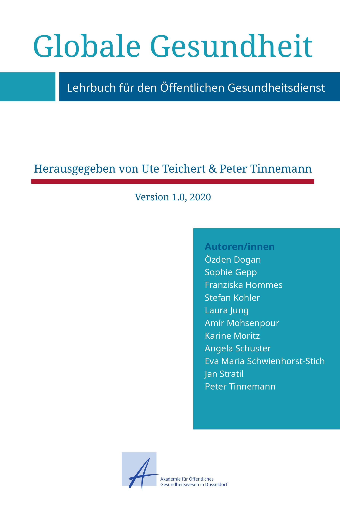

{:.imgcover}
*Globale Gesundheit - Lehrbuch für den Öffentlichen Gesundheitsdienst*

Durch die COVID-19 Pandemie hat sich die Wahrnehmung des Öffentlichen
Gesundheitsdienst (ÖGD) innerhalb weniger Monaten deutlich verändert. Seine
Tätigkeit an der Schnittstelle von Öffentlicher und Globaler Gesundheit sind
plötzlich für Politik und Gesellschaft Alltagsbestandteil geworden. Zuvor wurde
die Arbeit im ÖGD selten derart in Verbindung mit Globaler Gesundheit gebracht.

Das vorliegende Lehrbuch betrachtet Schnittstellen von Öffentlicher und Globaler
Gesundheit am Beispiel des ÖGD. Neben einer Einführung in beide Themenfelder
werden deren Verbindungen in der ÖGD Praxis dargestellt. Es werden
Einstiegsmöglichkeiten und Karrierewege im ÖGD aufgezeigt sowie Menschen im ÖGD,
die an Schnittstellen von Öffentlicher und Globaler Gesundheit arbeiten,
vorgestellt.

Dieses Lehrbuch richtet sich insbesondere an Auszubildende und Fachkräfte in der
Medizin und anderen Gesundheitswissenschaften mit Interesse an Öffentlicher und
Globaler Gesundheit. Sie sollen in unterschiedlichen Phasen ihrer Karriere auf
die Berufsfelder im ÖGD als Alternativen oder Ergänzung zu klassischen
Klinik-Biographien aufmerksam gemacht werden. Durch das Lehrbuch können
allerdings auch bereits im ÖGD tätige Menschen Bezüge und Querverbindungen
zwischen Öffentlicher und Globaler Gesundheit kennenlernen.

Die in dem vorliegenden Lehrbuch zusammengefassten Inhalte beruhen auf
theoretischer Auseinandersetzung und praktischer Erfahrung der Autoren/innen mit
dem Thema Globale Gesundheit. Das Lehrbuch ist ein Gemeinschaftswerk aller
beteiligten Autoren/innen und gibt nicht die Meinung einzelner Institutionen
oder einzelner Autoren/innen.

Es wird zukünftig aktualisiert und erweitert werden. Wir freuen uns daher, wenn
Sie uns Ihre Anregungen, Kommentare und Ergänzungen mitteilen. Schicken Sie
diese bitte an **lehrbuch\@akademie-oegw.de**

Das vorliegende Lehrbuch ist Teil einer Open-Access-Lehrbuchreihe, die für die
praktische Arbeit im ÖGD erarbeitet wurden. Hierbei handelt es sich um ein
gemeinsames Projekt der Akademie für Öffentliches Gesundheitswesen und des [Open
Science Lab](https://www.tib.eu/de/forschung-entwicklung/open-science) der
[Technischen Informationsbibliothek](https://www.tib.eu/) (TIB) des
Leibniz-Informationszentrums Technik und Naturwissenschaften, gefördert durch
das [Bundesministerium für
Gesundheit](https://www.bundesgesundheitsministerium.de/).

Wir nutzen [Hypothes.is](https://hypothes.is/) für Ihre Kommentare und
Ergänzungen unseres Lehrbuches.
